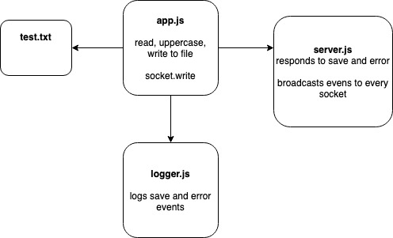

#  LAB

## lab-19-queue-server

### Author: Bonnie Wang

### Links and Resources

- [submission PR](https://github.com/401-advanced-javascript-bw/lab-19-queue-server/pull/1)
- [queue-server](https://lab-19-queue-server-bw.herokuapp.com/)
- [logger](https://lab-19-logger-bw.azurewebsites.net)
- [api-server](https://lab-19-api-server-bw.herokuapp.com/)

#### Documentation

- [jsdoc](http://xyz.com) (Server assignments)

### Modules

#### `app.js -> read, uppercase, write files`

#### `server.js -> monitor database and file events`

### Setup

#### `.env` requirements

- `PORT` - Port Number

#### Running the app

- `npm i`
- `node server.js`
- `node app.js ./files/test.txt`

